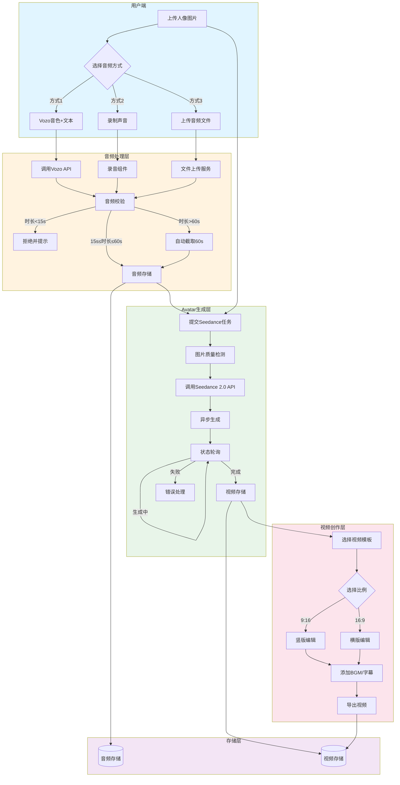
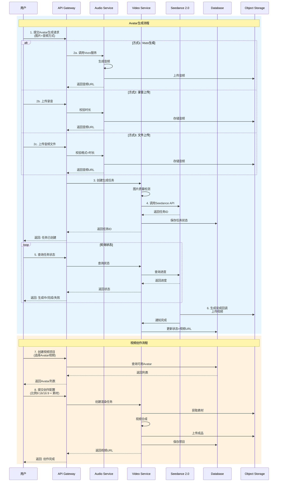
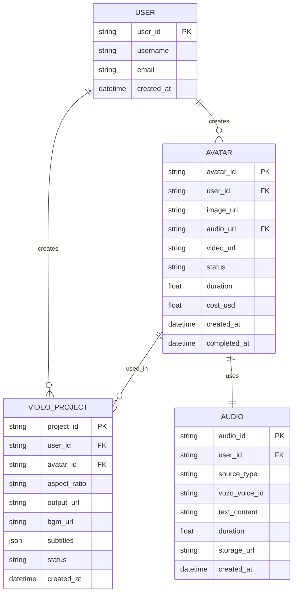

# Photo to Avatar 功能 PRD

> **文档版本**: v1.0  
> **创建日期**: 2026-04-18  
> **产品负责人**: 陈可爱  
> **状态**: 需求确认阶段

---

## 1. 背景与目标

### 1.1 背景
用户希望通过上传人像照片和音频，快速生成数字人 Avatar 形象视频，并基于该 Avatar 创建更多视频内容。

### 1.2 目标
- 提供简单易用的 Photo to Avatar 视频生成能力
- 支持多种音频输入方式，满足不同场景需求
- 生成的 Avatar 视频可用于后续视频创作

### 1.3 目标用户
- 内容创作者
- 电商卖家
- 营销人员
- 普通用户（想要创建个人数字形象）

---

## 2. 功能概述

### 2.1 核心功能
| 模块 | 功能描述 |
|------|----------|
| **Avatar 生成** | 上传人像图片 + 音频，生成 15s+ 数字人视频 |
| **视频创作** | 使用已生成的 Avatar 视频创建新视频（支持 9:16 / 16:9） |
| **音频管理** | 三种音频输入方式，灵活满足需求 |

### 2.2 技术方案
- **视频生成引擎**: Seedance 2.0 (doubao-seedance-2.0-fast)
- **分辨率**: 720p
- **音频生成**: Vozo API（方式1）

---

## 3. 详细功能设计

### 3.1 音频输入方式

#### 方式 1: Vozo 音色生成
| 字段 | 说明 |
|------|------|
| 输入 | 选择 Vozo 音色 + 固定文本 |
| 输出 | 自动生成音频文件 |
| 长度限制 | 根据文本自动生成（需确保≥15s） |
| 适用场景 | 批量生成、标准话术 |

**流程**:
```
用户选择音色 → 输入固定文本 → 调用 Vozo API → 生成音频 → 校验时长(≥15s)
```

#### 方式 2: 直接录制
| 字段 | 说明 |
|------|------|
| 输入 | 麦克风实时录制 |
| 时长限制 | 15s ≤ 时长 ≤ 60s |
| 校验规则 | 小于15s提示重新录制，超过60s自动截取前60s |
| 适用场景 | 个性化内容、真人配音 |

**录制流程**:
```
开始录制 → 实时显示时长 → 停止录制 → 时长校验 → 合规保存/不合规提示
```

#### 方式 3: 音频文件上传
| 字段 | 说明 |
|------|------|
| 支持格式 | MP3, WAV, M4A, AAC |
| 大小限制 | ≤ 50MB |
| 时长处理 | <15s: 拒绝上传；>60s: 自动截取前60s |
| 适用场景 | 已有音频素材复用 |

**上传校验流程**:
```
选择文件 → 格式校验 → 时长检测 → 
├── <15s: 提示"音频时长需≥15秒"
├── 15s-60s: 直接通过
└── >60s: 提示"已自动截取前60秒" → 截取保存
```

---

### 3.2 Avatar 视频生成

#### 输入要求
| 类型 | 要求 |
|------|------|
| **人像图片** | 清晰正面照，面部占比>30%，建议分辨率≥512x512 |
| **音频** | 通过上述三种方式之一提供，时长≥15s |

#### 输出规格
| 参数 | 值 |
|------|-----|
| 引擎 | Seedance 2.0 (doubao-seedance-2.0-fast) |
| 分辨率 | 720p |
| 时长 | ≥15s（与音频时长一致） |
| 格式 | MP4 |

#### 生成流程
```
提交任务 → 图片质量检测 → 音频预处理 → 调用 Seedance API → 
异步生成 → 状态轮询 → 生成完成 → 存储视频 → 返回下载链接
```

---

### 3.3 视频创作（二次创作）

#### 功能描述
使用已生成的 Avatar 视频作为素材，创建新的视频内容。

#### 支持规格
| 比例 | 分辨率 | 适用场景 |
|------|--------|----------|
| 9:16 | 720x1280 | 短视频、抖音/快手/小红书 |
| 16:9 | 1280x720 | 横屏视频、YouTube/B站 |

#### 编辑能力（MVP）
- 选择 Avatar 视频片段
- 添加背景音乐（可选）
- 添加字幕（可选）
- 导出最终视频

---

## 4. 成本分析

### 4.1 Seedance 2.0 成本
| 项目 | 费用 |
|------|------|
| 单价 | 4 CNY / 视频 |
| 美元换算 | **~0.55 USD** / 视频（按 7.2 汇率） |
| 分辨率 | 720p |
| 模型 | doubao-seedance-2.0-fast |

### 4.2 其他成本预估
| 服务 | 预估成本 | 说明 |
|------|----------|------|
| Vozo API | 按调用量 | 方式1使用 |
| 存储 (OSS/S3) | 按容量 | 音频/视频存储 |
| CDN | 按流量 | 视频分发 |

---

## 5. Pipeline 架构图

### 5.1 整体架构



### 5.2 API 调用链路



### 5.3 数据模型



---

## 6. API 接口设计

### 6.1 Avatar 生成接口

#### 创建 Avatar 任务
```http
POST /api/v1/avatars
Content-Type: multipart/form-data

Request:
{
  "image": File,              // 人像图片
  "audio_type": "vozo|record|upload",
  // 方式1: Vozo
  "vozo_voice_id": "string",
  "text_content": "string",
  // 方式2/3: 录音/上传
  "audio_file": File
}

Response:
{
  "code": 0,
  "data": {
    "avatar_id": "avt_xxx",
    "status": "processing",   // processing | completed | failed
    "estimated_cost_usd": 0.55,
    "created_at": "2026-04-18T10:00:00Z"
  }
}
```

#### 查询任务状态
```http
GET /api/v1/avatars/{avatar_id}

Response:
{
  "code": 0,
  "data": {
    "avatar_id": "avt_xxx",
    "status": "completed",
    "progress": 100,
    "video_url": "https://cdn.xxx.com/avatars/avt_xxx.mp4",
    "duration": 18.5,
    "cost_usd": 0.55,
    "created_at": "2026-04-18T10:00:00Z",
    "completed_at": "2026-04-18T10:02:30Z"
  }
}
```

### 6.2 视频创作接口

#### 创建视频项目
```http
POST /api/v1/video-projects
Content-Type: application/json

Request:
{
  "avatar_id": "avt_xxx",
  "aspect_ratio": "9:16",    // 或 "16:9"
  "bgm_url": "optional",
  "subtitles": [
    {"start": 0, "end": 5, "text": "Hello"}
  ]
}

Response:
{
  "code": 0,
  "data": {
    "project_id": "vp_xxx",
    "status": "rendering",
    "preview_url": "https://...",
    "created_at": "2026-04-18T10:05:00Z"
  }
}
```

---

## 7. 错误处理

| 错误码 | 场景 | 处理方式 |
|--------|------|----------|
| 4001 | 音频时长<15s | 提示用户重新上传/录制 |
| 4002 | 图片质量不达标 | 提示上传更清晰的人像照片 |
| 4003 | 不支持的音频格式 | 提示转换格式后重新上传 |
| 5001 | Seedance生成失败 | 自动重试3次，仍失败则通知用户 |
| 5002 | 视频合成失败 | 记录日志，通知技术团队 |

---

## 8. 验收标准

### 8.1 功能验收
- [ ] 支持3种音频输入方式
- [ ] 音频时长校验准确（<15s拒绝，>60s截取）
- [ ] Seedance生成视频时长≥15s
- [ ] 支持9:16和16:9两种比例输出
- [ ] 成本计算准确（0.55 USD/视频）

### 8.2 性能验收
- [ ] 音频上传/处理 < 5s
- [ ] Seedance生成 < 3分钟（720p, 15s视频）
- [ ] 视频创作导出 < 1分钟
- [ ] API响应时间 < 500ms

### 8.3 质量验收
- [ ] 生成视频画面清晰，无明显瑕疵
- [ ] 口型与音频同步良好
- [ ] 支持常见的图片/音频格式

---

## 9. 附录

### 9.1 Seedance 2.0 API 参考
```python
# 伪代码示例
import requests

def create_avatar_video(image_url, audio_url):
    response = requests.post(
        "https://api.seedance.ai/v2/generate",
        headers={"Authorization": "Bearer {API_KEY}"},
        json={
            "model": "doubao-seedance-2.0-fast",
            "resolution": "720p",
            "image_url": image_url,
            "audio_url": audio_url,
            "duration": "auto"  # 根据音频自动
        }
    )
    return response.json()["task_id"]
```

### 9.2 成本计算示例
| 月生成量 | CNY成本 | USD成本 |
|----------|---------|---------|
| 100 | ¥400 | $55 |
| 1,000 | ¥4,000 | $550 |
| 10,000 | ¥40,000 | $5,500 |

---

*文档结束*
